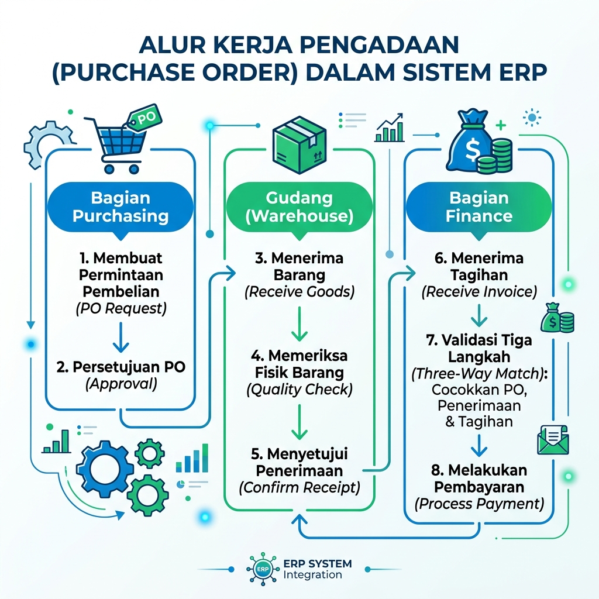
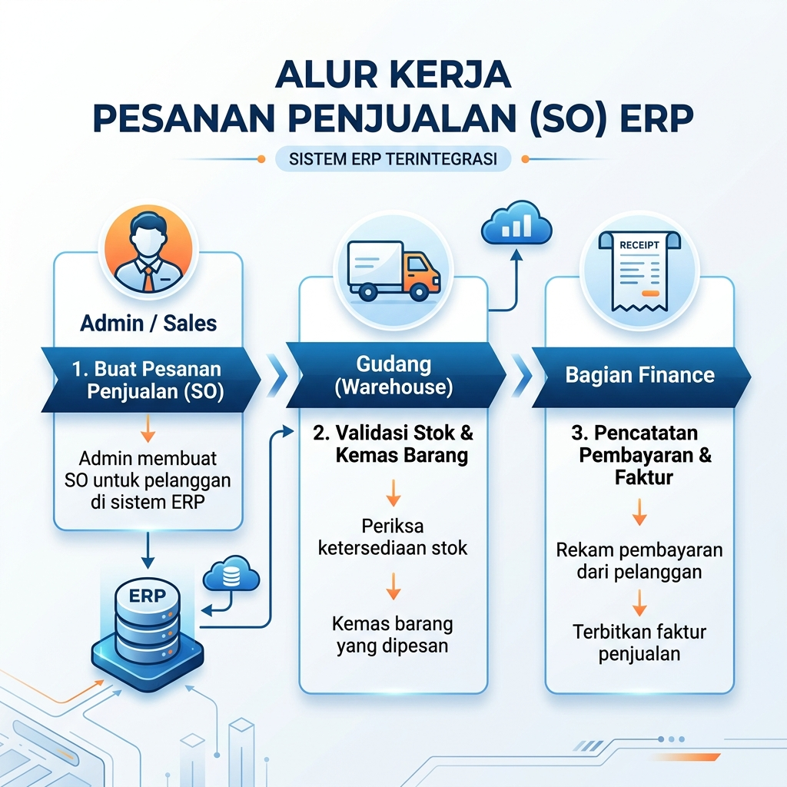

# Alur Kerja & Tata Cara Operasional StockSell ERP

Dokumen ini menjelaskan prosedur kerja standar (SOP) untuk setiap departemen dalam menggunakan sistem StockSell ERP.

---

## 1. Alur Pengadaan Barang (Purchase Order)

Digunakan oleh bagian **Purchasing** untuk mengisi kembali stok barang dari supplier.

### **Tata Cara Baru (Pembayaran Dahulu):**
1.  **Purchasing**: Masuk ke menu **"Purchase Orders"**, klik **"Buat PO Baru"**. Pilih supplier dan produk yang ingin dibeli. Klik **"Submit"**. Status PO adalah `pending` dan `payment_status` = `unpaid`.
2.  **Keuangan (Finance)**: Memantau PO berstatus `pending`. Klik **"Bayar Tagihan"** untuk melunasi tagihan supplier terlebih dahulu. Setelah lunas, `payment_status` berubah menjadi `paid`.
3.  **Gudang (Warehouse)**: Memantau PO berstatus `pending` yang **sudah lunas** di antrean dashboard mereka. Setelah barang fisik tiba dari supplier, klik **"Konfirmasi Terima"** untuk menambah stok secara otomatis. Status PO akan menjadi `received` (Selesai).

---

## 2. Alur Penjualan Barang (Sales Order)

Digunakan oleh bagian **Admin / Sales** untuk memproses pesanan dari pelanggan.

### **Tata Cara Baru (Pembayaran Dahulu):**
1.  **Admin / Sales**: Masuk ke menu **"Sales Orders"**, klik **"Buat SO Baru"**. Masukkan data pelanggan dan produk. Status awal adalah `processing` dan `payment_status` = `unpaid`.
2.  **Keuangan (Finance)**: Memeriksa tagihan SO yang sedang berjalan. Setelah menerima pembayaran penuh dari customer, klik **"Bayar Sekarang"** untuk mengubah `payment_status` menjadi `paid`. Status SO tetap `processing`.
3.  **Gudang (Warehouse)**: Memantau antrean SO yang **sudah lunas** di dashboard. Klik **"Siapkan & Kirim Barang"** untuk melakukan picking, packing, dan shipping fisik. Stok akan berkurang otomatis dan status SO berubah menjadi `completed` (Selesai).

---

## 3. Manajemen Inventaris & Stok

Digunakan oleh **Warehouse** untuk menjaga akurasi data barang.

### **Tata Cara:**
-   **Log Pergerakan**: Lihat menu **"Log Pergerakan Stok"** untuk melacak histori masuk/keluar barang secara detail.
-   **Penyesuaian Stok**: Jika ada selisih stok (barang rusak/hilang), gunakan menu **"Stock Adjustment"** untuk melakukan koreksi manual.
-   **Filter Stok Rendah**: Gunakan filter pada daftar produk untuk melihat barang yang sudah mencapai batas minimal stok.
