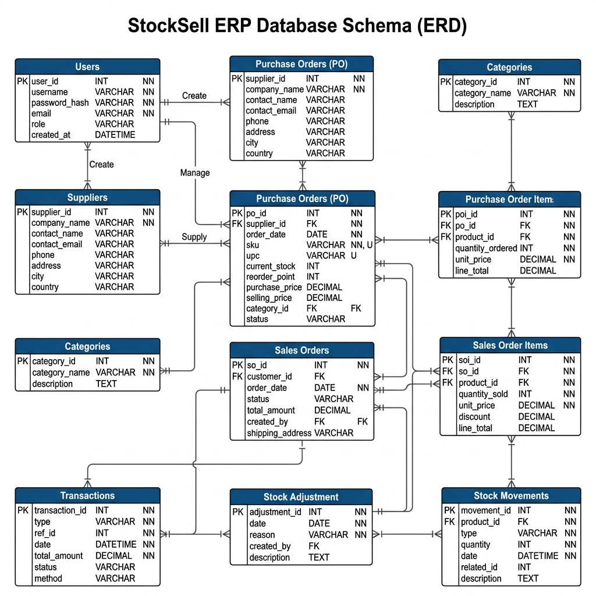
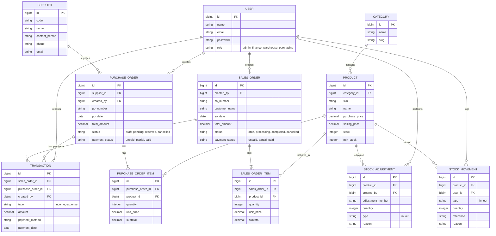

# Entity Relationship Diagram (ERD) - StockSell ERP

Diagram ini menunjukkan hubungan antar entitas utama dalam sistem StockSell ERP.

---

## Penjelasan Relasi Utama:

1.  **Pengadaan (Purchasing)**:
    - `Purchasing` membuat `PurchaseOrder` yang terhubung ke satu `Supplier`.
    - `PurchaseOrder` berisi banyak `PurchaseOrderItem` (produk yang dibeli).
    - Finance melunasi pembayaran (`Transaction` - Expense) terlebih dahulu, kemudian Warehouse mengonfirmasi penerimaan fisik barang (`StockMovement` - Inbound) yang mengubah status PO menjadi `received`.

2.  **Penjualan (Sales)**:
    - `Admin` membuat `SalesOrder` untuk pelanggan.
    - `SalesOrder` berisi banyak `SalesOrderItem` (produk yang dijual).
    - Finance menerima pelunasan pembayaran (`Transaction` - Income) terlebih dahulu, kemudian Warehouse mengemas dan mengirimkan barang fisik (`StockMovement` - Outbound) yang mengubah status SO menjadi `completed`.

3.  **Manajemen Stok (Inventory)**:
    - Setiap perubahan stok baik dari PO, SO, maupun manual recorded di `StockMovement`.
    - `StockAdjustment` digunakan untuk koreksi stok manual (misal: barang rusak atau selisih opname).
